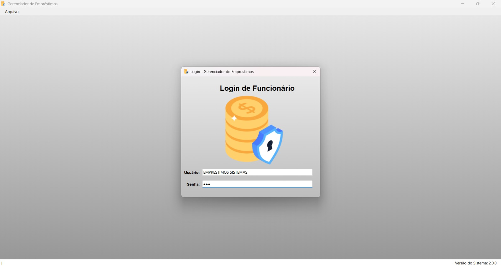
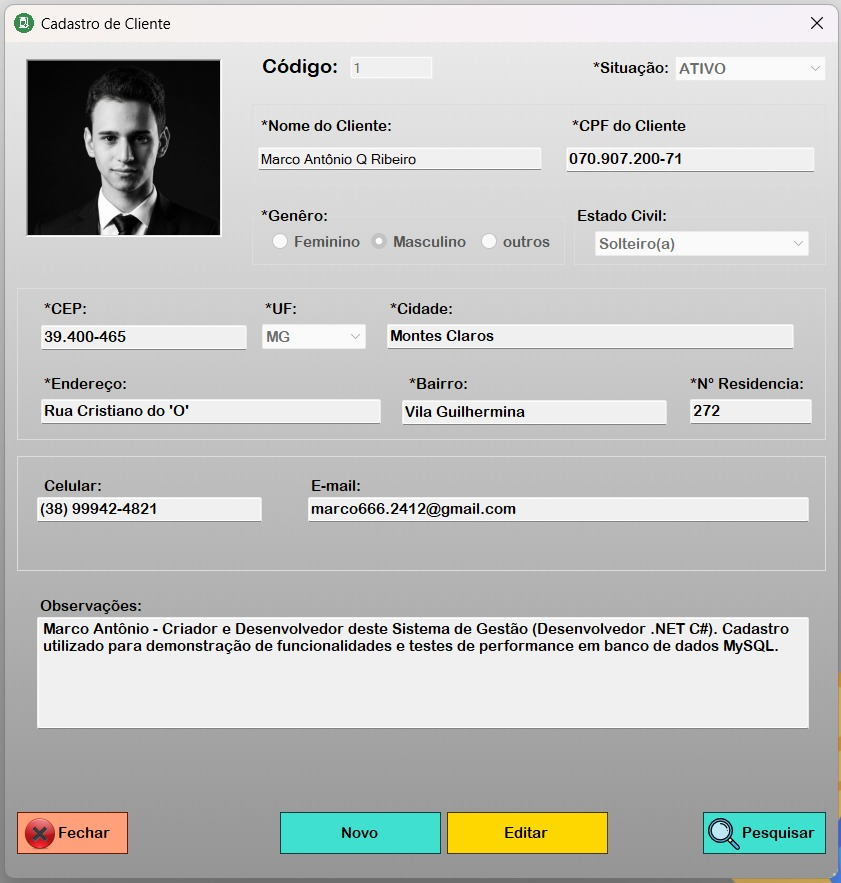
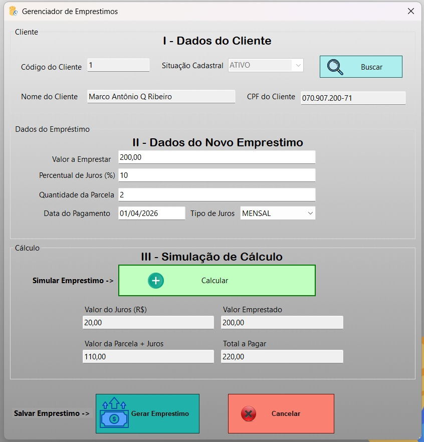
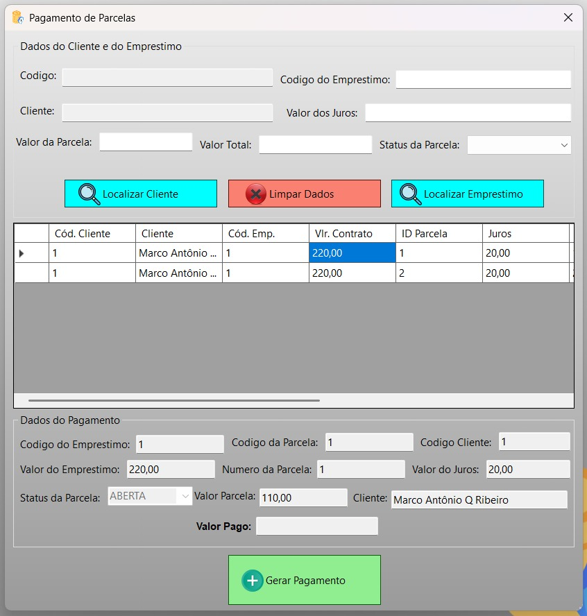
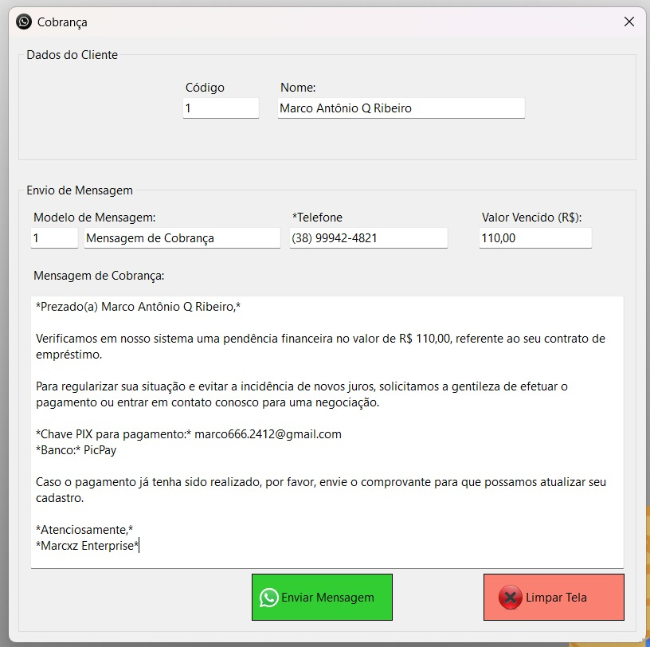

# 💰 Gerenciador de Empréstimos

Sistema desktop desenvolvido em **C# utilizando Windows Forms e MySQL** para gerenciamento completo de **clientes, empréstimos e controle de parcelas**.

O objetivo do projeto é simular um sistema utilizado por empresas financeiras para controlar operações de crédito, permitindo o cadastro de clientes, criação de empréstimos, geração automática de parcelas e gerenciamento de pagamentos.

---

# 📷 Telas do Sistema

## 🔐 Tela de Login



## 👤 Cadastro de Clientes



## 💰 Cadastro de Empréstimos



## 💳 Pagamento de Empréstimos



## 📲 Cobrança de Parcelas



---

# ⚙️ Funcionalidades

O sistema possui diversas funcionalidades voltadas para o controle financeiro de empréstimos.

### 👤 Gestão de Clientes

* Cadastro de clientes pessoa física e jurídica
* Armazenamento de dados pessoais e endereço
* Upload de imagem do cliente
* Consulta e edição de registros

### 💰 Controle de Empréstimos

* Cadastro de novos empréstimos
* Definição de juros **mensal ou diário**
* Cálculo automático do valor total do empréstimo
* Geração automática das parcelas

### 📊 Controle de Parcelas

* Registro das parcelas em **contas a receber**
* Consulta de parcelas abertas, pagas ou atrasadas
* Atualização automática de status

### 💳 Pagamentos

* Registro de pagamento das parcelas
* Atualização automática de valores pagos
* Registro da data de pagamento

### 🔄 Estorno de Pagamentos

* Estorno de parcelas pagas
* Registro do motivo do estorno
* Histórico de estornos realizados

### 🔐 Controle de Acesso

* Sistema de login
* Senhas protegidas com **BCrypt**
* Controle de permissões por funcionário

### 📲 Cobrança de Clientes

* Integração com **WhatsApp Web**
* Envio de mensagens de cobrança

### 📝 Lembretes Internos

* Sistema de lembretes para funcionários
* Organização de tarefas

---

# 🛠 Tecnologias Utilizadas

O projeto foi desenvolvido utilizando as seguintes tecnologias:

* **C#**
* **.NET**
* **Windows Forms**
* **MySQL Server**
* **MySQL Connector**
* **BCrypt.Net** (Hash de senha)

---

# 🗄 Estrutura do Banco de Dados

O sistema utiliza um banco relacional com as principais tabelas:

* `cliente`
* `emprestimos`
* `conta_receber`
* `funcionario`
* `funcionario_tela_privilegio`
* `telas_sistema`
* `modelo_mensagem`
* `lembrete`
* `estorno_pagamento`

O banco possui **relacionamentos com chaves estrangeiras** garantindo integridade dos dados.

---

# 🚀 Como Executar o Projeto

## 1️⃣ Clonar o Repositório

```bash
git clone https://github.com/Marcxz24/Gerenciador_Emprestimos.git
```

---

# 2️⃣ Abrir no Visual Studio

Abra o arquivo da solução:

```
Gerenciador_Emprestimos.sln
```

---

# 3️⃣ Restaurar o Banco de Dados

O banco de dados está disponível na pasta:

```
database
```

Arquivo:

```
emprestimosbd.sql
```

Este arquivo já contém:

* Criação do banco
* Criação das tabelas
* Relacionamentos
* Usuário inicial do sistema
* Estrutura completa do banco

### Como restaurar

1. Instale o **MySQL Server**
2. Abra o **MySQL Workbench**
3. Acesse:

```
Server → Data Import
```

4. Selecione:

```
Import from Self-Contained File
```

5. Escolha o arquivo:

```
database/emprestimosbd.sql
```

6. Clique em **Start Import**

O banco será criado automaticamente.

---

# ⚙️ Configurar Conexão com o Banco

Após restaurar o banco, configure a conexão no projeto.

Abra o arquivo:

```
database/ConexaoBancoDeDados.cs
```

Altere as credenciais de acesso ao MySQL.

Exemplo:

```csharp
Server=localhost;
Port=3306;
Database=emprestimosbd;
Uid=SEU_USUARIO;
Pwd=SUA_SENHA;
```

Substitua pelos dados do seu MySQL.

---

# ▶️ Executar o Sistema

Após configurar o banco:

1. Compile o projeto no **Visual Studio**
2. Execute a aplicação

O sistema iniciará normalmente.

---

# 🎯 Objetivo do Projeto

Este projeto foi desenvolvido com finalidade **educacional**, com foco no aprendizado de:

* Desenvolvimento de aplicações desktop
* Manipulação de banco de dados
* Regras de negócio financeiras
* Segurança de autenticação
* Estruturação de sistemas completos

---

# 👨‍💻 Desenvolvedor

**Marco Antônio**

Projeto desenvolvido para estudo e prática de desenvolvimento em **C# e banco de dados MySQL**.

---
